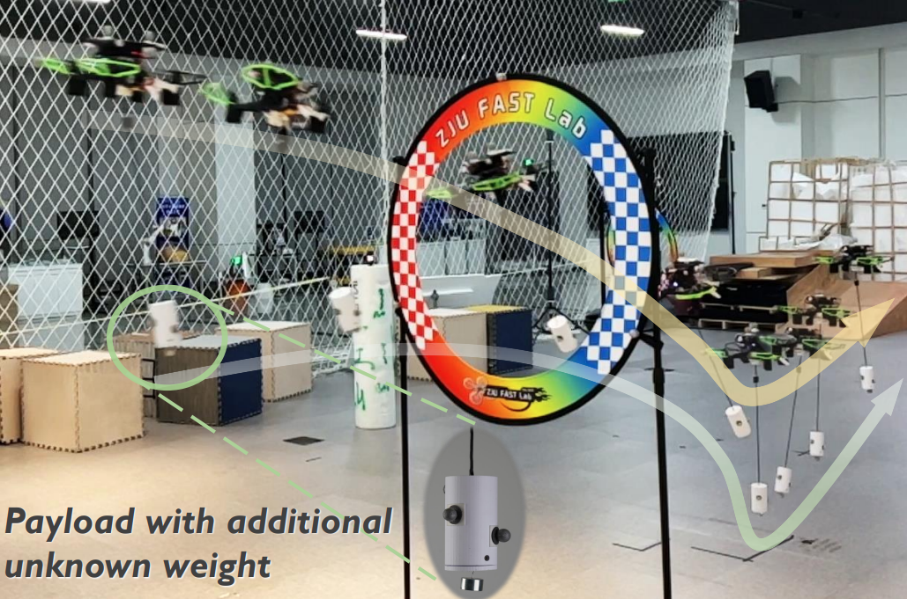

# AutoTrans: Control-Oriented Trajectory Workflow

[](https://youtu.be/X9g-ivBqy5g)

**Video**: [YouTube](https://youtu.be/X9g-ivBqy5g) | [Bilibili](https://www.bilibili.com/video/BV1aM4y1a7c9)

---

## Overview
- 全流程支持控制端直接生成圆形、八字和螺旋解析轨迹，可与原有规划器多项式轨迹一键切换。
- MPC 控制器通过 `reference_generator` 封装的 PVAJSC 采样接口获取高阶导数，保持 yaw 规划与负载平坦化逻辑一致。
- `replan.launch` / `controller_only.launch` 与双套 RViz 配置对应双模式，便于对比仿真与控制-only 演示。
- 阶段 6 新增单元测试，逐项校验解析轨迹的导数公式、reset 行为以及有限长度螺旋的收尾状态。

---

## 依赖与环境准备

1. **系统要求**：Ubuntu 18.04/20.04 + ROS（推荐 Noetic）。
2. **安装依赖包**
   ```bash
   sudo apt update
   sudo apt install ros-"${ROS_DISTRO}"-mavros-msgs
   sudo apt install python3-setuptools   # 提供 catkin 工具所需的 pkg_resources
   ```
   可选：若编译时看到 PCL 关于 `pcap/png/libusb` 的 WARNING，可以安装 `libpcap-dev libpng-dev libusb-1.0-0-dev` 后重新编译。
3. **创建工作空间**
   ```bash
   mkdir -p ~/autotrans_ws/src
   cd ~/autotrans_ws/src
   git clone https://github.com/HKUST-Aerial-Robotics/AutoTrans.git
   cd ~/autotrans_ws
   ```

---

## 编译与测试流程

1. **首次全量编译**
   ```bash
   catkin build
   source devel/setup.bash
   ```
   为方便使用，可将 `source ~/autotrans_ws/devel/setup.bash` 添加进 `~/.bashrc`。

2. **Stage 6 单元测试（解析轨迹）**
   ```bash
    catkin build payload_mpc_controller
    catkin run_tests payload_mpc_controller --no-deps --target reference_generator_test
    catkin_test_results
   ```
   测试覆盖解析轨迹的 PVAJSC 精确度、螺旋轨迹收尾导数归零以及 `reset()` 函数行为。

3. **增量编译建议**
   - 调整控制器相关代码：`catkin build payload_mpc_controller`
   - 调整仿真器：`catkin build so3_quadrotor`
   - 调整可视化工具：`catkin build odom_visualization`

---

## 运行流程

### Step 1：控制-only 解析轨迹演示
```bash
roslaunch payload_planner controller_only.launch trajectory_mode:=helix
```
- 支持 `trajectory_mode:=circle|figure_eight|helix`；半径、角速度、中心等均可通过等名参数覆盖，若需自定义解析轨迹起点，可附加 `init_x/init_y/init_z`。
- 运行时观测：
  - `rostopic echo /mpc_controller_node/mpc/reference_trajectory`
  - `rostopic echo /mpc_controller_node/mpc/trajectory_predicted`
  - RViz 自动加载 `controller_only.rviz`，仅保留控制相关显示，`Geometry` MarkerArray 会渲染预测（蓝色）与参考（黄色/红色）无人机、载荷及缆绳模型；解析模式运行 10 个周期后，日志会输出无人机和载荷的 RMSE。
- 想要在线切换轨迹，可执行：
  ```bash
  rosparam set /mpc_controller_node/reference/mode circle
  rosparam set /mpc_controller_node/reference/use_planner false
  ```

### Step 2：规划器 + 控制器协同
```bash
roslaunch payload_planner replan.launch use_planner:=true
```
- 若置 `use_planner:=false` 可回到解析轨迹模式，并自动切换到精简 RViz 视图。
- 通过 RViz “2D Nav Goal” 下发目标；`/planning/trajectory` 与 `/mpc/...` 话题可用于验证规划器输出与 MPC 跟踪情况。

### Step 3：可视化配置
- `roslaunch payload_planner rviz.launch use_planner:=true`  
  → 全量仿真视图（含地图、障碍物等）。
- `roslaunch payload_planner rviz.launch use_planner:=false`  
  → 控制-only 视图（聚焦无人机-负载状态）。

---

## 验证清单
- `catkin build` 与 `reference_generator_test` 均通过。
- `controller_only.launch` 中 `/mpc/reference_trajectory` 与 `/mpc/trajectory_predicted` 在 RViz 中对齐，日志提示 `ANALYTIC trajectory tracking`。
- 切回 `use_planner:=true` 后日志出现 `ANALYTIC --> HOVER`，规划器话题恢复订阅。
- `roswtf` 与 `rostopic hz` 未报频率/连接异常。

---

## 常见问题 & Tips
- **解析轨迹不动**：确认 `rosparam get /mpc_controller_node/reference/use_planner` 为 `false`。
- **缺失话题**：使用 `rqt_graph` 或 `rostopic list | grep mpc` 排查发布者是否存在。
- **控制有抖动**：执行 `sudo apt install cpufrequtils` 后运行 `sudo cpufreq-set -g performance` 提升 MPC 求解性能。
- **参数恢复默认**：`rosparam load controller/payload_mpc_controller/config/mpc.yaml /mpc_controller_node`。

---

## Credits & Contact
- 代码基于 HKUST Aerial Robotics Group 原始 AutoTrans 框架，解析轨迹模块与 Stage 0-6 迭代由当前项目扩展。
- 技术交流：Haojia Li (hlied@connect.ust.hk)。欢迎提交 Issue/PR 共同完善。
